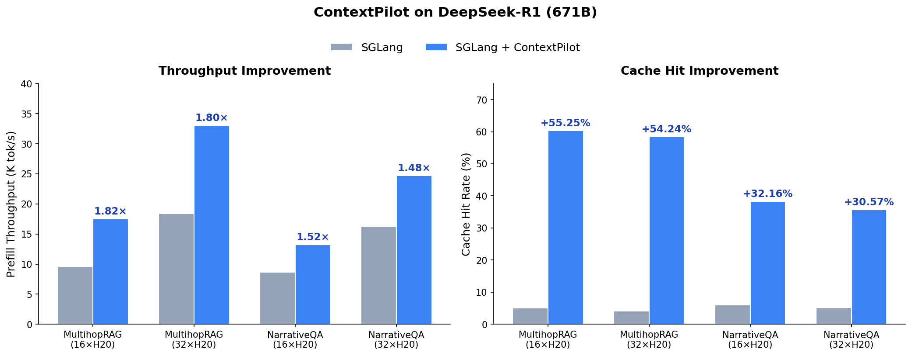

<div align="center">
  

  <h1><strong>ContextPilot: Efficient Long Context Inference with Context Reuse</strong></h1>

  [](https://www.python.org/)
  [](https://pypi.org/project/contextpilot/)
  [](LICENSE)

</div>

--------------------------------------------------------------------------------

| [**Documentation**](docs/README.md) | [**Examples**](examples/) | [**Benchmarks**](docs/reference/benchmarks.md) |

## News

- [2026/02] ContextPilot v0.3.2 released, supporting [PageIndex](https://github.com/VectifyAI/PageIndex) and [Mem0](https://github.com/mem0ai/mem0).
- [2026/01] ContextPilot has been accepted to MLSys 2026 🎉! See you in Bellevue, WA, USA.
- [2025/12] ContextPilot v0.2.0 released.

## About

ContextPilot is a fast optimization system on context engineering layer for agentic workloads:
1. **High Throughput & Cache Hit Ratio**: Boosting prefill throughput and prefix cache hit ratio with intelligent context reuse.
2. **Strong Compatibility**: Strong compatibility with existing popular RAG libraries (PageIndex), Agentic memory layer (Mem0), KV cache optimization engine (LMCache), and Inference engines (vLLM and SGLang).
3. **Negligible Accuracy Loss**: Achieving significant performance improvements with minimal to no accuracy degradation across various benchmarks.
3. **Widely Tested**: Tested with a wide range of RAG and Agentic AI applications.

## Target Workloads

1. **Trending Topic QA** — Search and generation for breaking news and hot topics beyond model knowledge
2. **Closed-Domain Long-Context QA** — QA over specialized corpora (novels, financial reports, legal documents) with retrieval or in-context search
3. **Large-Batch Long-Context Execution** — High-throughput inference where many requests share overlapping contexts; ContextPilot maximizes prefix reuse regardless of the search method
4. **Multi-Turn Conversations with Long-Term Memory** — Persistent context reuse across turns (e.g. [Mem0](https://github.com/mem0ai/mem0))

## Benchmark and Performance

### System Performance

<div align="center">

</div>

ContextPilot on DeepSeek-R1 maintains accuracy compared to SGLang, achieving 64.68% vs 64.15% F1 on MultihopRAG and 41.08% vs 40.20% F1 on NarrativeQA.

### Accuracy on MT-RAG Benchmark

<div align="center">

| Method | Qwen3-4B | Llama3.1-8B | Qwen3-30B-A3B |
|--------|----------|-------------|-----------|
| LMCache | 62.56 | **68.46** | 75.12 |
| CacheBlend | 50.33 | 56.52 | X |
| RadixCache | 62.56 | **68.46** | 75.12 |
| **ContextPilot** | **64.27** | 68.12 | **75.81** |

</div>

ContextPilot delivers **4-13x** improvements in cache hit rates and **1.5-3.5x** reductions in prefill latency for large-batch RAG workloads, while maintaining or improving accuracy.

**Furthermore**, ContextPilot has been tested to reduce input token costs by around **36%** with GPT-5.2.

See [Benchmarks](docs/reference/benchmarks.md) in the documentation for GPU vs CPU performance analysis and detailed benchmark methodology.

## Getting Started

### Installation

**Requirements:** Python >= 3.10

```bash
pip install contextpilot
```

Or install from source:
```bash
git clone https://github.com/SecretSettler/ContextPilot.git
cd ContextPilot
pip install -e .
```

More [detailed installation instructions](docs/getting_started/installation.md) are available in the docs.

### Quick Start

**Python API** — reorder contexts locally in 3 lines:

```python
import contextpilot as cp

# Each list = one query's retrieved doc IDs
contexts = [
    [5, 1, 3, 2],   # query 0
    [10, 11, 12],    # query 1
    [2, 3, 1, 4],    # query 2 (overlaps with query 0)
]

index = cp.build_context_index(contexts, use_gpu=False)
reordered, _, order, _ = cp.InterContextScheduler().schedule_contexts(index)
# reordered: [[1,2,3,5], [1,2,3,4], [10,11,12]]
# order:     [0, 2, 1]  — queries 0 & 2 grouped for prefix sharing
```

**HTTP Server** — stateless scheduling over REST:

```bash
python -m contextpilot.server.http_server --port 8765 --stateless

curl -X POST http://localhost:8765/schedule \
  -H "Content-Type: application/json" \
  -d '{"contexts": [[5,1,3,2], [10,11,12], [2,3,1,4]]}'
```

**Stateful mode** — incremental index with multi-session prefix reuse:

```bash
# Start stateful server
python -m contextpilot.server.http_server --port 8765

# Turn 1: build index (cold start, preserves original order)
curl -X POST http://localhost:8765/build \
  -H "Content-Type: application/json" \
  -d '{"contexts": [[5,1,3,2,4,6]]}'

# Turn 2: incremental build (reorders to match Turn 1's prefix)
curl -X POST http://localhost:8765/build \
  -H "Content-Type: application/json" \
  -d '{"contexts": [[3,6,2,5,1,4]]}'
# → reordered to [5,1,3,2,4,6] — 100% prefix cache hit
```

> **Note:** Stateful mode requires the [SGLang eviction patch](docs/guides/online_usage.md#sglang-integration) to sync KV cache evictions back to the ContextPilot index. Set `CONTEXTPILOT_INDEX_URL` on your inference engine to enable this.

See the [quickstart guide](docs/getting_started/quickstart.md) and [examples](examples/) for more.

## Documentation

Check out the ContextPilot [documentation](docs/README.md) for comprehensive guides.

## Examples

Go hands-on with our [examples](examples/), demonstrating how to address different use cases with ContextPilot.

## Contributing

We welcome and value all contributions! Please feel free to submit issues and pull requests.

## Citation
We will include the paper citation soon!
