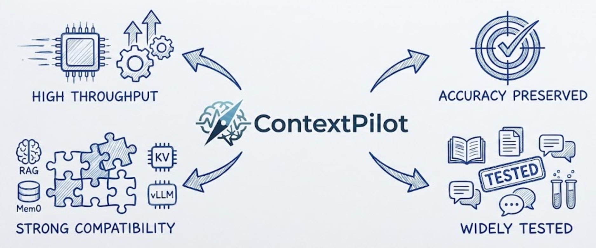
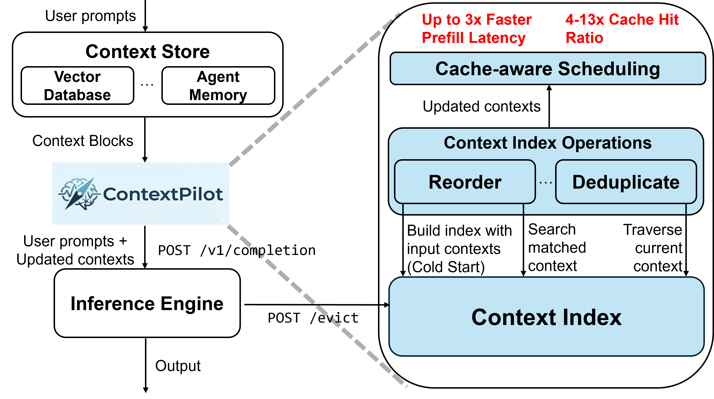
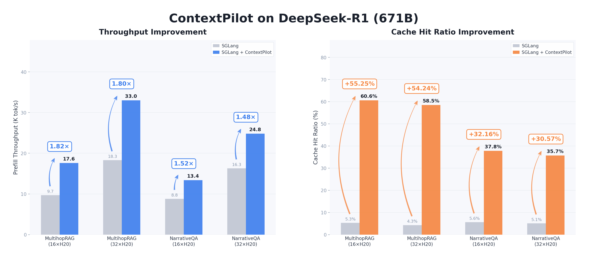

<div align="center">
  

  <h1><strong>ContextPilot: Fast Long-Context Inference via Context Reuse</strong></h1>

  [](https://www.python.org/)
  [](https://pypi.org/project/contextpilot/)
  [](LICENSE)

  <p>A lightweight middleware that accelerates long-context inference by optimizing context blocks before they reach the inference engine, turning prefix cache misses into hits. Drop-in compatible with vLLM, SGLang, and any RAG/agent pipeline. <strong>4-13x higher cache hit ratio | Up to 3x lower prefill latency | ~36% input token cost savings on hosted APIs.</strong></p>

</div>

--------------------------------------------------------------------------------

| [**Documentation**](docs/README.md) | [**Examples**](examples/) | [**Benchmarks**](docs/reference/benchmarks.md) |

## News

- [2026/02] ContextPilot v0.3.2 released, supporting [PageIndex](https://github.com/VectifyAI/PageIndex) and [Mem0](https://github.com/mem0ai/mem0).
- [2026/01] ContextPilot has been accepted to MLSys 2026 🎉! See you in Bellevue, WA, USA.
- [2025/12] ContextPilot v0.2.0 released.

## About

Long-context inference workloads (RAG, multi-turn chat with memory, tool-augmented agents) build prompts by prepending gathered context blocks (documents, memory entries, tool outputs, etc.) — often tens to hundreds of thousands of tokens. Across requests these blocks often **overlap** but arrive in **different orders**, and may be **duplicated** across turns. The inference engine sees a different token sequence each time, causing prefix cache misses and redundant KV-state recomputation over long contexts.

ContextPilot is a long-context optimization layer that sits between context assembly and inference, maximizing prefix sharing and eliminating redundancy:

1. **High Throughput & Cache Hit Ratio** — Intelligent context reuse that boosts prefill throughput and prefix cache hit ratio.
2. **Drop-in Compatibility** — Works with RAG libraries ([PageIndex](https://github.com/VectifyAI/PageIndex)), agent memory ([Mem0](https://github.com/mem0ai/mem0)), KV cache engines ([LMCache](https://github.com/LMCache/LMCache)), and inference backends (vLLM, SGLang).
3. **Negligible Accuracy Loss** — Significant speedups with minimal to no accuracy degradation across benchmarks.
4. **Widely Tested** — Validated across diverse RAG and agentic AI applications.

<div align="center">

</div>

Context blocks from upstream stores (vector DBs, agent memory, etc.) pass through ContextPilot, which maintains a **Context Index** of what the engine has cached. On each request, **Context Index Operations** — **Reorder** (align shared blocks into a common prefix) or **Deduplicate** (replace repeated blocks with reference hints) — optimize the context, and **Cache-aware Scheduling** determines the execution order to maximize prefix sharing. The optimized prompt is forwarded via the standard OpenAI-compatible API; an eviction callback (`POST /evict`) keeps the index in sync when the engine reclaims KV-cache memory.

> For details on architecture, design, and implementation, see our [paper](https://arxiv.org/abs/2511.03475) and the [documentation](docs/README.md).

## Core Concepts

ContextPilot currently provides two core optimizations — **reorder** or **deduplicate** — targeting different sources of redundancy in long-context workloads.

### Reorder

`cp.reorder()` places **shared blocks at the beginning** of the prompt so consecutive requests share the longest possible common prefix, enabling KV-cache reuse. To preserve answer quality, ContextPilot injects an **importance ranking** so the model still prioritizes blocks in their original relevance order.

### Deduplicate

In multi-turn conversations, successive turns frequently gather **many of the same context blocks**, wasting tokens and compute.

`cp.deduplicate()` compares the current turn's context blocks against prior turns (tracked by `conversation_id`). Duplicate blocks are replaced with lightweight **reference hints** (e.g., *"See Doc 3 from previous context"*); only genuinely new blocks are sent in full — typically reducing redundant tokens by **30-60%**.

## Target Workloads

1. **Trending Topic QA** — Search and generation for breaking news beyond model knowledge.
2. **Closed-Domain Long-Context QA** — QA over specialized corpora (novels, financial reports, legal docs) with search or in-context lookup.
3. **Large-Batch Long-Context Execution** — High-throughput inference where many requests share overlapping contexts.
4. **Multi-Turn Conversations with Long-Term Memory** — Persistent context reuse across turns (e.g., [Mem0](https://github.com/mem0ai/mem0)).

## Benchmark and Performance

### System Performance

<div align="center">

</div>

ContextPilot (Offline) on DeepSeek-R1 matches or slightly improves accuracy compared to SGLang, achieving 64.68% vs 64.15% F1 on MultihopRAG and 41.08% vs 40.20% F1 on NarrativeQA.

### Accuracy on MT-RAG Benchmark (Online Scheduling)

<div align="center">

| Method | Qwen3-4B | Llama3.1-8B | Qwen3-30B-A3B |
|--------|----------|-------------|-----------|
| LMCache | 62.56 | **68.46** | 75.12 |
| CacheBlend | 50.33 | 56.52 | X |
| RadixCache | 62.56 | **68.46** | 75.12 |
| **ContextPilot** | **64.27** | 68.12 | **75.81** |

</div>

Compared to vanilla RadixCache (SGLang default), ContextPilot delivers **4-13x** higher cache hit rates and **up to 3x** lower prefill latency on large-batch long-context RAG workloads, while maintaining accuracy (Llama3.1-8B: 68.12 vs 68.46, within noise margin).

Hosted API providers charge less for cached input tokens. By increasing the cache hit ratio, ContextPilot reduces input token costs by **~36%** on GPT-5.2 (measured on MT-RAG).

See [Benchmarks](docs/reference/benchmarks.md) for GPU vs CPU performance analysis and detailed methodology.

## Getting Started

### Installation

**Requirements:** Python >= 3.10

```bash
pip install contextpilot
```

Or install from source:
```bash
git clone https://github.com/Edinburgh-AgenticAI/ContextPilot.git
cd ContextPilot
pip install -e .
```

More [detailed installation instructions](docs/getting_started/installation.md) are available in the docs.

### Quick Start

Add **one call** (`cp.reorder()`) before inference to rearrange context blocks so that shared content aligns into a common prefix, enabling cache reuse. An importance ranking in the prompt preserves accuracy.

| Mode | When to Use | How It Works |
|------|-------------|--------------|
| **Online** | Multi-turn (e.g., chatbot + [Mem0](https://github.com/mem0ai/mem0)) | Tracks previously cached blocks; moves overlapping ones to the prefix each turn |
| **Offline** | Batch / single-shot | Globally reorders and schedules all requests for maximum prefix sharing |

Both modes work with any OpenAI-compatible endpoint (vLLM, SGLang, etc.) — no changes to your inference deployment. They support both direct API calls (shown below) and HTTP server deployment (see the [online usage guide](docs/guides/online_usage.md)).

---

#### Online Mode

Multi-turn chatbot with Mem0 or RAG where each turn's context blocks partially overlap. `cp.reorder()` moves shared blocks to the prefix so the engine reuses cached KV states.

```python
from openai import OpenAI
import contextpilot as cp

# vLLM default: http://localhost:8000/v1 | SGLang default: http://localhost:30000/v1
client = OpenAI(base_url="http://localhost:30000/v1", api_key="...")
cp_live = cp.ContextPilot(use_gpu=False)

# Simulated per-turn context blocks from Mem0 — partially overlapping across turns
turn_contexts = [
    ["Transformers use self-attention", "GPT is based on transformers", "BERT is bidirectional"],
    ["RNNs use hidden states", "GPT is based on transformers", "LSTMs solve vanishing gradients"],
    ["Attention computes QKV", "Transformers use self-attention", "GPT is based on transformers"],
]
queries = ["What are transformers?", "How do RNNs compare?", "Explain attention in detail."]

for turn_idx, (query, blocks) in enumerate(zip(queries, turn_contexts)):
    reordered, indices = cp_live.reorder(blocks)  # ← reorder for prefix sharing
    ctx = reordered[0]
    # Turn 2: "GPT is based on transformers" moves to prefix (cache hit)
    # Turn 3: "Transformers …", "GPT …" both move to prefix

    docs_section = "\n".join(f"[{i+1}] {doc}" for i, doc in enumerate(ctx))
    pos = {doc: i + 1 for i, doc in enumerate(ctx)}
    importance_ranking = ">".join(str(pos[doc]) for doc in blocks if doc in pos)

    response = client.chat.completions.create(
        model="Qwen/Qwen3-4B",
        messages=[
            {"role": "system", "content": (
                f"Answer the question based on the provided documents.\n\n"
                f"<documents>\n{docs_section}\n</documents>\n\n"
                f"Read the documents in this importance ranking: {importance_ranking}\n"
                f"Prioritize information from higher-ranked documents."
            )},
            {"role": "user", "content": query},
        ],
    )
    print(f"[Turn {turn_idx+1}] Q: {query}")
    print(f"A: {response.choices[0].message.content}\n")
```

> **Note:** When the engine evicts KV-cache entries under memory pressure, ContextPilot's index can go stale. Install the eviction patch for [SGLang](docs/guides/online_usage.md#sglang-integration) or [vLLM](docs/guides/online_usage.md#vllm-integration) to keep the index in sync. See the [online usage guide](docs/guides/online_usage.md).

---

#### Offline Mode

Batch of requests with overlapping context blocks. `cp.reorder()` globally reorders blocks and schedules execution order so queries with similar contexts run consecutively, maximizing cache reuse. See the [offline usage guide](docs/guides/offline_usage.md) for details. Offline mode can also be deployed as an HTTP server without eviction sync — see [Stateless Mode](docs/guides/online_usage.md#stateless-mode).

```python
import asyncio
import openai
import contextpilot as cp

# vLLM default: http://localhost:8000/v1 | SGLang default: http://localhost:30000/v1
BASE_URL = "http://localhost:30000/v1"
cp_batch = cp.ContextPilot(use_gpu=False)

queries = ["What is AI?", "Explain neural networks", "What is deep learning?"]
all_contexts = [
    ["Doc about AI", "Doc about ML", "Doc about computing"],
    ["Doc about neural nets", "Doc about deep learning"],
    ["Doc about ML", "Doc about AI", "Doc about deep learning basics"],
]

reordered_ctx, order = cp_batch.reorder(all_contexts)  # ← global reorder + schedule

# Build requests in the scheduled order
messages_batch = []
for ctx, orig_idx in zip(reordered_ctx, order):
    docs = "\n".join(f"[{i+1}] {d}" for i, d in enumerate(ctx))
    pos = {d: i + 1 for i, d in enumerate(ctx)}
    ranking = ">".join(str(pos[d]) for d in all_contexts[orig_idx] if d in pos)
    messages_batch.append(dict(
        model="Qwen/Qwen3-4B",
        messages=[
            {"role": "system", "content": f"Answer based on the documents.\n\n"
             f"<documents>\n{docs}\n</documents>\n\n"
             f"Importance ranking: {ranking}"},
            {"role": "user", "content": queries[orig_idx]},
        ],
    ))

# Send all requests concurrently
async def generate_all():
    ac = openai.AsyncOpenAI(base_url=BASE_URL, api_key="...")
    return await asyncio.gather(*[ac.chat.completions.create(**r) for r in messages_batch])

for resp, idx in zip(asyncio.run(generate_all()), order):
    print(f"Q: {queries[idx]}\nA: {resp.choices[0].message.content}\n")
```

#### Deduplication
ContextPilot also supports [automatic context deduplication](docs/guides/multi_turn.md) to eliminate redundant context blocks across turns (30-60% savings).

## Documentation

See the ContextPilot [documentation](docs/README.md) for comprehensive guides.

## Examples

See our [examples](examples/): [Mem0 integration](examples/mem0_locomo_example.py), [PageIndex RAG](examples/pageindex_e2e_example.py), and [offline batch scheduling](examples/offline/).

## Contributing

We welcome and value all contributions! Please feel free to submit issues and pull requests.

## Citation
```bibtex
@misc{contextpilot2026,
      title={ContextPilot: Fast Long-Context Inference via Context Reuse}, 
      author={Yinsicheng Jiang and Yeqi Huang and Liang Cheng and Cheng Deng and Xuan Sun and Luo Mai},
      year={2026},
      eprint={2511.03475},
      archivePrefix={arXiv},
      primaryClass={cs.LG},
      url={https://arxiv.org/abs/2511.03475}, 
}
```
