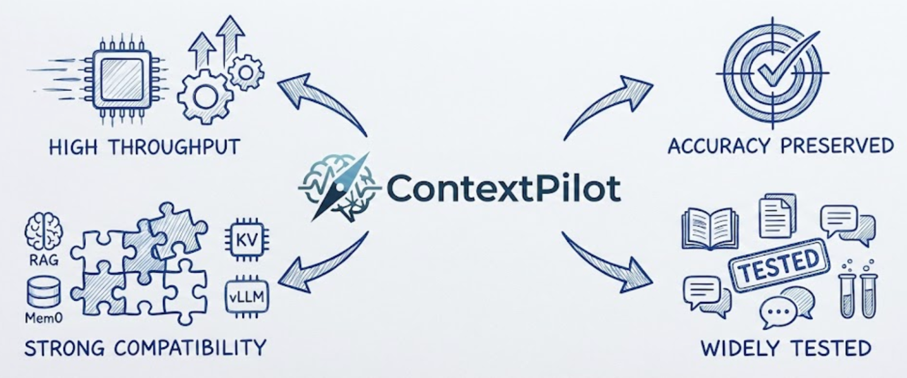
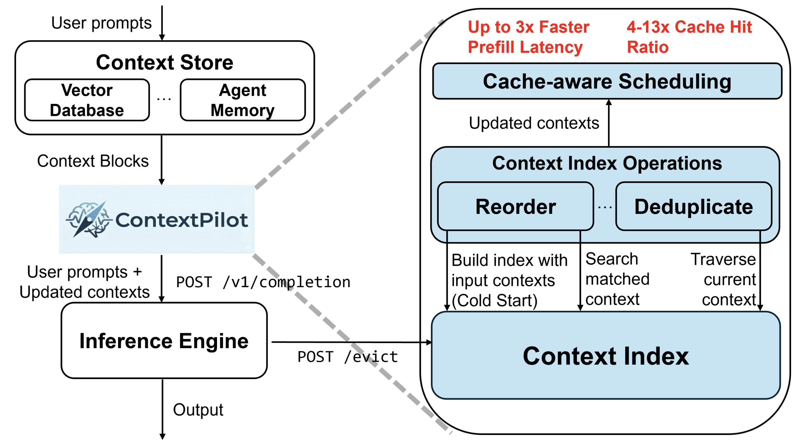

<div align="center">
  

  <h2><strong>ContextPilot: Fast Long-Context Inference via Context Reuse</strong></h2>

  [](https://www.python.org/)
  [](https://pypi.org/project/contextpilot/)
  [](LICENSE)

  <p><strong>4–12× cache hits | 1.5–3× faster prefill | ~36% token savings</strong> across vLLM, SGLang, RAG, AI Agents, and more.</p>

</div>

--------------------------------------------------------------------------------

| [**Documentation**](https://efficientcontext.github.io/contextpilot-docs/) | [**Examples**](examples/) | [**Benchmarks**](https://efficientcontext.github.io/contextpilot-docs/reference/benchmarks) | [**Docker**](https://efficientcontext.github.io/contextpilot-docs/getting_started/docker) | [**Paper**](https://arxiv.org/abs/2511.03475) |

## News

- [2026/03] Supports [Hermes Agent](https://github.com/NousResearch/hermes-agent) as a native context engine plugin — [guide](docs/guides/hermes.md)
- [2026/03] Supports [OpenClaw](https://openclaw.ai) — [guide](docs/guides/openclaw.md) | [benchmark](docs/benchmarks/openclaw.md)
- [2026/03] Supports cloud APIs (OpenAI, Anthropic, MiniMax) — [cache sync](docs/guides/cache_sync.md)
- [2026/03] ContextPilot now can run on **macOS / Apple Silicon** via [llama.cpp](docs/guides/mac_llama_cpp.md).
- [2026/02] ContextPilot v0.3.2 released, supporting [PageIndex](https://github.com/VectifyAI/PageIndex) and [Mem0](https://github.com/mem0ai/mem0).
- [2026/01] ContextPilot has been accepted to MLSys 2026 🎉! See you in Bellevue, WA, USA.

## About

Long-context workloads (RAG, memory chat, tool-augmented agents) prepend many context blocks. Across requests, these blocks often overlap but get reordered or duplicated, changing token prefixes and triggering cache misses and redundant KV recomputation. Common examples include (1) Trending Topic QA, (2) Closed-Domain Long-Context QA, (3) Batched Long-Context Inference, (4) multi-turn conversations with long-term memory and many more.

ContextPilot sits between context assembly and inference to maximize prefix reuse and remove duplicates:

1. **Higher throughput & cache hits** — boosts prefill throughput and prefix cache hit ratio via context reuse.  
2. **Drop-in solutions** — supports [OpenClaw](https://openclaw.ai) ([guide](docs/guides/openclaw.md)), [Hermes Agent](https://github.com/NousResearch/hermes-agent) ([guide](docs/guides/hermes.md)), [PageIndex](https://github.com/VectifyAI/PageIndex), [Mem0](https://github.com/mem0ai/mem0), [LMCache](https://github.com/LMCache/LMCache), [vLLM](https://github.com/vllm-project/vllm), [SGLang](https://github.com/sgl-project/sglang), [llama.cpp](docs/guides/mac_llama_cpp.md), and cloud APIs (OpenAI, Anthropic).
3. **No compromise in reasoning quality** — can even improve with extremely long contexts.
4. **Widely tested** — validated across diverse RAG and agentic workloads.

It maintains a **Context Index** of cached content, then per request applies **Reorder** (align shared blocks into a common prefix) and/or **Deduplicate** (replace repeats with reference hints), plus **cache-aware scheduling** to maximize prefix sharing. The optimized prompt is sent via the OpenAI-compatible API; `POST /evict` keeps the index synced when KV cache is reclaimed. See its design overview below.

<div align="center">

</div>

> For more design details, see [Paper](https://arxiv.org/abs/2511.03475) and [Documentation](https://efficientcontext.github.io/contextpilot-docs/).

## Performance at a Glance

**OpenClaw Agent on RTX 5090** — 60 enterprise document analysis tasks ([claw-tasks](https://github.com/EfficientContext/ClawTasks)), Qwen3-4B-Instruct via SGLang. [Full results →](docs/benchmarks/openclaw.md)

| Metric | OpenClaw + SGLang | + ContextPilot | Δ |
|--------|-------------------|----------------|---|
| Prompt tokens / request (avg) | 45,771 | 33,622 | **-26.5%** |
| Prompt tokens / request (P99) | 92,785 | 51,581 | **-44.4%** |
| Wall time (avg) | 26.1s | 20.8s | **-20.4%** |
| Wall time (P99) | 68.8s | 50.4s | **-26.6%** |
| Accuracy | 245/245 | 245/245 | ✓ |

**Qwen3-4B on 1×A6000** — multi-turn memory chat with [Mem0](https://github.com/mem0ai/mem0) on the [LoCoMo](https://github.com/snap-research/locomo) benchmark.

| Context Size | Method | TTFT (s) | LLM Judge |
|--------------|--------|----------|-----------|
| 5 (long context memory) | SGLang | 0.1051 | 0.418 |
|            | **SGLang + ContextPilot** | **0.0548** | 0.414 |
| 100 memories | SGLang | 0.1012 | 0.437 |
|            | **SGLang + ContextPilot** | **0.0554** | 0.420 |

>ContextPilot results in mem0 table are without context annotation — an optional feature that adds original importance ranking to reordered context blocks, which can further improve answer quality (see [Paper](https://arxiv.org/abs/2511.03475)).

**Llama-3.2-1B on Apple Silicon** — MultihopRAG with llama.cpp, no GPU server required.

| Device | Method | Avg Latency (ms) |
|--------|--------|-----------------|
| M3 (MacBook Air, 16 GB) | llama.cpp | 3,315 |
|  | **llama.cpp + ContextPilot** | **1,378** |
| M5 (MacBook Air, 32 GB) | llama.cpp | 2,157 |
|  | **llama.cpp + ContextPilot** | **911** |

Settings: `Llama-3.2-1B-Instruct-Q4_K_M.gguf`, Metal offload (`-ngl 99`), `--cache-reuse 256`, `--parallel 4`, context 32768 tokens. See the [Mac + llama.cpp guide](docs/guides/mac_llama_cpp.md).

We also evaluated on academic RAG (Qwen3-32B, 4×A6000) and production MoE inference (DeepSeek-R1-671B, 16×H20) — see [RAG benchmarks](docs/benchmarks/rag.md) and [paper](https://arxiv.org/abs/2511.03475).

## Installation

**Requirements:** Python >= 3.10

---

### OpenClaw

**Option A: Native Plugin** (recommended — zero external dependencies)

```bash
openclaw plugins install @contextpilot-ai/contextpilot
```

Then enable in `~/.openclaw/openclaw.json`:

```json
{
  "plugins": {
    "slots": { "contextEngine": "contextpilot" },
    "entries": { "contextpilot": { "enabled": true } }
  }
}
```

Restart OpenClaw. Done — ContextPilot runs in-process, no proxy needed.

**Option B: HTTP Proxy** (for self-hosted models or custom backends)

```bash
pip install contextpilot

python -m contextpilot.server.http_server \
  --port 8765 --infer-api-url http://localhost:30000   # SGLang
  # or: --infer-api-url https://api.anthropic.com      # Anthropic
  # or: --infer-api-url https://api.openai.com         # OpenAI
```

Then set OpenClaw's base URL to `http://localhost:8765/v1`. See the [full OpenClaw integration guide](docs/guides/openclaw.md) for details.

---

### Hermes Agent

Native plugin — zero Hermes source changes, zero external dependencies:

```bash
hermes plugins install EfficientContext/ContextPilot
hermes plugins   # select: Context Engine → contextpilot
```

Typical savings: **40–50% input tokens** on agentic workloads with repeated file reads. See the [Hermes integration guide](docs/guides/hermes.md) for details.

---

### vLLM / SGLang

**From PyPI** — the vLLM and SGLang hooks are installed automatically:
```bash
pip install contextpilot          # CPU index computation
pip install "contextpilot[gpu]"   # GPU index computation (CUDA 12.x)
```

**From source** — run `install_hook` manually after install, since editable installs do not copy the `.pth` file to site-packages:
```bash
git clone https://github.com/EfficientContext/ContextPilot.git
cd ContextPilot
pip install -e .                  # CPU
pip install -e ".[gpu]"           # GPU (CUDA 12.x)
python -m contextpilot.install_hook   # one-time: enables automatic vLLM / SGLang integration
```

The `install_hook` step writes a `.pth` file into your site-packages so the vLLM and SGLang hooks load automatically at Python startup — no code changes required. To uninstall: `python -m contextpilot.install_hook --remove`.

---

### Mac / Apple Silicon — llama.cpp

**From PyPI:**
```bash
pip install contextpilot
xcode-select --install    # one-time: provides clang++ to compile the native hook
```

**From source:**
```bash
git clone https://github.com/EfficientContext/ContextPilot.git
cd ContextPilot
pip install -e .
xcode-select --install    # one-time: provides clang++ to compile the native hook
```

> **Why `xcode-select`?** The llama.cpp integration uses a small C++ shared library injected into `llama-server` via `DYLD_INSERT_LIBRARIES`. It is compiled automatically on first use and requires `clang++` from Xcode Command Line Tools.

---

More [detailed installation instructions](https://efficientcontext.github.io/contextpilot-docs/getting_started/installation) are available in the docs.

Docker images are also available for both all-in-one and standalone deployment. See the [Docker guide](https://efficientcontext.github.io/contextpilot-docs/getting_started/docker).

## Getting Started

### Quick Start with OpenClaw

```bash
# Ask OpenClaw to analyze vendor contracts (ContextPilot deduplicates shared content automatically)
openclaw agent --message "Read contracts/contract_alpha_cloud.txt and summarize the liability terms."
openclaw agent --message "Read contracts/contract_beta_ai.txt and compare its liability with Alpha."
openclaw agent --message "Read contracts/contract_gamma_security.txt. Rank all three by liability exposure."
```

When the agent reads multiple documents sharing content (contracts from the same template, proposals with shared methodology), ContextPilot automatically deduplicates identical blocks — reducing prefill tokens by ~27% with zero accuracy loss. See the [integration guide](docs/guides/openclaw.md) and [benchmark](docs/benchmarks/openclaw.md).

---

### Quick Start with Context Ordering

Add **one call** (`cp_instance.optimize()`) before inference to rearrange context blocks so that shared content aligns into a common prefix, enabling cache reuse. An importance ranking in the prompt preserves accuracy.

| Mode | When to Use | How It Works |
|------|-------------|--------------|
| **Online** | Multi-turn (e.g., chatbot + [Mem0](https://github.com/mem0ai/mem0)) | Tracks previously cached blocks; moves overlapping ones to the prefix each turn |
| **Offline** | Batch / single-shot | Globally reorders and schedules all requests for maximum prefix sharing |

Both modes work with any OpenAI-compatible endpoint (vLLM, SGLang, etc.) — no changes to your inference deployment. They support both direct API calls (shown below) and HTTP server deployment (see the [online usage guide](https://efficientcontext.github.io/contextpilot-docs/guides/online_usage)).

---

#### Accelerating Online Inference

Multi-turn chatbot with Mem0 or RAG where each turn's context blocks partially overlap. `cp_instance.optimize()` moves shared blocks to the prefix so the engine reuses cached KV states.

```python
from openai import OpenAI
# Step 1: Import ContextPilot
import contextpilot as cp

client = OpenAI(base_url="http://localhost:30000/v1", api_key="EMPTY")
# Step 2: Create a ContextPilot instance
cp_instance = cp.ContextPilot(use_gpu=False)

for query in queries:
    contexts = get_contexts(query)                         # Mem0, Retriever, ...
    # Step 3: Optimize context ordering and build ready-to-use messages
    messages = cp_instance.optimize(contexts, query)

    response = client.chat.completions.create(
        model="Qwen/Qwen3-4B",
        messages=messages,
    )
    print(f"Q: {query}\nA: {response.choices[0].message.content}\n")
```

> **Note:** When the engine evicts KV-cache entries under memory pressure, ContextPilot's index can go stale. Set `CONTEXTPILOT_INDEX_URL` when launching [SGLang or vLLM](https://efficientcontext.github.io/contextpilot-docs/guides/online_usage#inference-engine-integration) to enable automatic eviction sync. For distributed setups, see [Distributed Setup](https://efficientcontext.github.io/contextpilot-docs/getting_started/installation#distributed-setup).

---

#### Accelerating Offline Inference

Batch of requests with overlapping context blocks. `cp_instance.optimize_batch()` globally reorders blocks and schedules execution order so queries with similar contexts run consecutively, maximizing cache reuse. See the [offline usage guide](https://efficientcontext.github.io/contextpilot-docs/guides/offline_usage) for details. Offline mode can also be deployed as an HTTP server without eviction sync — see [Stateless Mode](https://efficientcontext.github.io/contextpilot-docs/guides/online_usage#stateless-mode).

```python
import asyncio
import openai
# Step 1: Import ContextPilot
import contextpilot as cp

BASE_URL = "http://localhost:30000/v1"
# Step 2: Create a ContextPilot instance
cp_instance = cp.ContextPilot(use_gpu=False)

all_contexts = [get_contexts(q) for q in queries]          # Mem0, Retriever, ...
# Step 3: Optimize — reorder, schedule, and build prompts in one call
messages_batch, order = cp_instance.optimize_batch(all_contexts, queries)

# Send all requests concurrently
async def generate_all():
    ac = openai.AsyncOpenAI(base_url=BASE_URL, api_key="EMPTY")
    return await asyncio.gather(*[ac.chat.completions.create(
        model="Qwen/Qwen3-4B", messages=m
    ) for m in messages_batch])

for resp, idx in zip(asyncio.run(generate_all()), order):
    print(f"Q: {queries[idx]}\nA: {resp.choices[0].message.content}\n")
```

For a detailed walkthrough with concrete examples, see the [Quick Start Guide](https://efficientcontext.github.io/contextpilot-docs/getting_started/quickstart). For more fine-grained control, you can also use `cp_instance.reorder()` and `cp_instance.deduplicate()` directly — see the [API reference](https://efficientcontext.github.io/contextpilot-docs/reference/api) and [multi-turn deduplication guide](https://efficientcontext.github.io/contextpilot-docs/guides/multi_turn).

### Adoption Examples

See many useful adoption examples: [Mem0 integration](https://efficientcontext.github.io/contextpilot-docs/guides/mem0), [PageIndex RAG](https://efficientcontext.github.io/contextpilot-docs/guides/pageindex), [offline batch scheduling](https://efficientcontext.github.io/contextpilot-docs/guides/offline_usage), and [multi-turn deduplication](https://efficientcontext.github.io/contextpilot-docs/guides/multi_turn).

## Citation
```bibtex
@inproceedings{contextpilot2026,
  title     = {ContextPilot: Fast Long-Context Inference via Context Reuse},
  author    = {Jiang, Yinsicheng and Huang, Yeqi and Cheng, Liang and Deng, Cheng and Sun, Xuan and Mai, Luo},
  booktitle = {Proceedings of the 9th Conference on Machine Learning and Systems (MLSys 2026)},
  year      = {2026},
  url       = {https://arxiv.org/abs/2511.03475}
}
```

## Contributing

We welcome and value all contributions! Please feel free to submit issues and pull requests.
