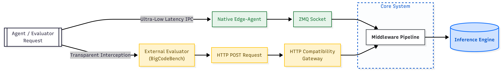
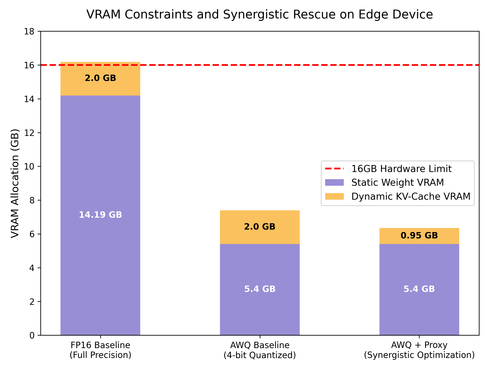

# ContextPilot: L7 Middleware Proxy for Multi-Agent Workflows


## Overview
ContextPilot is an advanced Layer-7 middleware proxy designed to neutralize the **"Orchestration Tax"** in multi-agent LLM deployments. By seamlessly intercepting API traffic between agents and inference endpoints, ContextPilot applies extreme context compression and Cache-Homogenization techniques. This forces divergent, bloated agent requests to realign with the strict radix-tree structures of state-of-the-art KV-Caches (like vLLM), dramatically reducing network I/O, API costs, and VRAM consumption on edge devices.

## Academic Attribution & Contributions
This repository serves as the empirical apparatus for an MSc Dissertation, built upon a foundational library engineered by senior PhD researchers.

*   **Foundational Work (Prior PhD Research):** The core ContextPilot mechanism—including Prefix Cache Indexing, Exact Lexical Deduplication, and Context Reordering—was originally conceptualized as an intrusive, low-level kernel patch targeting datacenter compute clusters.
*   **MSc Project Contributions:** This dissertation engineered the transition to edge computing and multi-agent workflows. The novel contributions include:
    *   **L7 Middleware Gateway Architecture:** Transformed the intrusive kernel patch into a completely transparent, dual-interface (ZMQ + HTTP) reverse-proxy, ensuring framework-agnostic interception.
    *   **Dynamic Skill Filtering & Semantic Pruning:** Engineered the `SkillAwareContextPlugin` to neutralize dictionary bloat and the `DynamicPruningPlugin` (using NLP embeddings like `all-MiniLM-L6-v2`) to transcend exact-match limitations.
    *   **Black-Box Shadow Telemetry:** Engineered mathematical projections for closed-source APIs (like DeepSeek) where low-level hypervisor cache access is impossible.
    *   **Edge Device Viability (Synergistic Quantization):** Proved the system works on extreme edge hardware (16GB GPUs) by pairing it with 4-bit AWQ quantized models to prevent Out-Of-Memory errors.

## Core Architecture (The 5 Plugins)
ContextPilot achieves cache homogenization through a pipeline of 5 decoupling plugins:

*   **`ContextDedupPlugin`**: Eliminates redundant conversational history across multi-turn agent execution by substituting identical context windows with lightweight cryptographic hashes.
*   **`DynamicPruningPlugin`**: Leverages `all-MiniLM-L6-v2` to aggressively prune historically irrelevant semantic noise, applying a dynamic cutoff threshold to protect critical context while maximizing compression.
*   **`SkillAwareContextPlugin`**: Filters monolithic tool registries, dropping unused functions dynamically based on an oracle or predictive router to ensure bloated JSON schemas do not invalidate prefixes.
*   **`ContextReorderPlugin`**: Deterministically sorts system prompts, tool schemas, and few-shot examples to guarantee rigid prefix alignment for the backend KV-Cache.
*   **`KVCacheLookupPlugin`**: A high-speed ZeroMQ (ZMQ) IPC backbone that bypasses HTTP overheads entirely, allowing native agents to directly inject cache references to the engine.

### Architectural Diagram

*Dual-Interface architecture of the Middleware Token Proxy, illustrating the high-speed ZMQ IPC backbone for native agents and the transparent HTTP Compatibility Gateway.*

### Edge Deployment & VRAM Optimization

*Comparison of VRAM allocation across FP16 Baseline, AWQ Baseline, and AWQ+Proxy, highlighting the elimination of Out-Of-Memory (OOM) failures.*

## Empirical Performance Data

### Cache Homogenization (DeepSeek V4 Pro)
By systematically excising task-specific tool noise and deduplicating prefixes, ContextPilot achieves massive secondary cache hits on backend inference engines.

| Benchmark | Baseline Cache Hits | Proxy Cache Hits | Architectural Phenomenon |
| :--- | :--- | :--- | :--- |
| **BigCodeBench** | 457,344 | 289,152 | Client-Side Bandwidth Conservation |
| **MCP-Atlas** | 18,688 | 66,304 | Cache-Homogenization via Prefix Alignment |

### Compression Ceilings & Accuracy (ELM GPT-5.5)
The Full Triple Pipeline demonstrates that hash-based deduplication and semantic-based pruning stack flawlessly with negligible accuracy variance.

| Pipeline Configuration | Pass@1 Accuracy | History Saved (Chars / %) | Tools Reduced |
| :--- | :--- | :--- | :--- |
| **Baseline (Unoptimized)** | 62.4% | 0 (0%) | 0% |
| **Semantic Pruning Only** | 63.2% | 76,380 (5.33%) | 70% |
| **Full Triple Pipeline** | 63.2% | 168,720 (11.78%) | 70% |

## Quick Start / Installation
Clone the repository and install the proxy server and all associated dependencies locally.

```bash
git clone https://github.com/SNM-SNM/contextpilot-openclaw-token-proxy.git
cd contextpilot-openclaw-token-proxy
python -m venv venv
source venv/bin/activate
pip install -e .
pip install -r requirements.txt
```

## Reproducibility Guide

The empirical validation pipelines for **BigCodeBench** and **MCP-Atlas** (using DeepSeek V4 Pro and OpenAI/ELM GPT-5.5) have been fully refactored into a parameter-driven, production-ready interface.

### Standard Local Execution
Six unified entry points are provided in the root directory. They all support the following standard arguments:
- `--limit <N>`: Restrict the evaluation to `N` tasks (useful for fast dry-runs).
- `--plugins <list>`: Comma-separated string to selectively toggle optimizations (e.g., `dedup,dynamic,skill` or simply `all`).

**Example: Fast Dry-Run Testing (5 Tasks)**
Run a rapid verification of the proxy server, the dynamic pruning logic, and the LLM endpoint connection:
```bash
./eval_openai_bigcodebench.sh --limit 5 --plugins dynamic
```

**Example: Full Benchmark Execution (All Plugins Stacked)**
Execute the complete empirical evaluation pipeline with maximum concurrency:
```bash
./eval_deepseek_mcpatlas.sh --plugins all
```

**Example: Ablation & Quantization Studies**
Execute the specialized dissertation studies:
```bash
./eval_ablation_dynamic_pruning.sh --limit 10
./eval_local_vram_quantization.sh --limit 10
```

### Telemetry Analysis
When the pipeline completes, the proxy will gracefully flush its telemetry buffers and print the final metric teardown directly to your standard output. Check the terminal logs to view the total characters saved, tools filtered, and most importantly, the `prompt_cache_hit_tokens` successfully returned by the backend engine!

### Academic Markers (HPC / SLURM Execution)
For academic markers attempting to reproduce the exact empirical environment on the university `Teaching` cluster, all original `#SBATCH` wrapper scripts have been archived in the `evaluation/slurm_launchers/` directory.

To run via SLURM:
```bash
cd evaluation/slurm_launchers/
sbatch submit_test_all_plugins_elm.slurm
```


